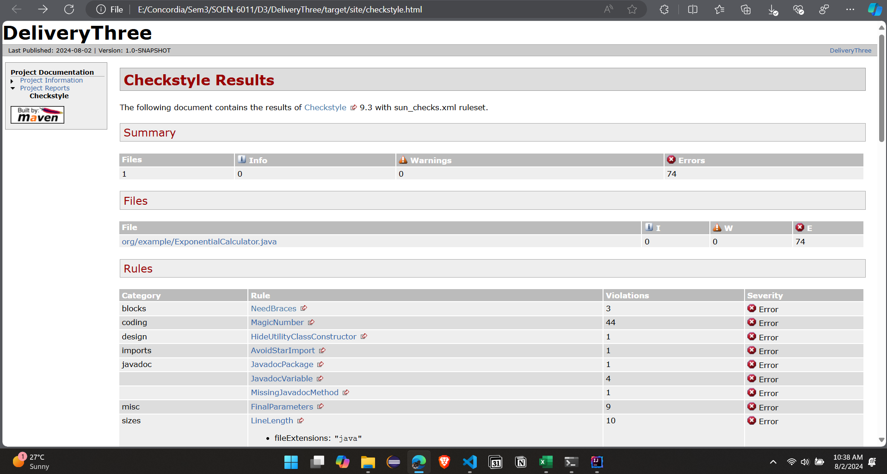
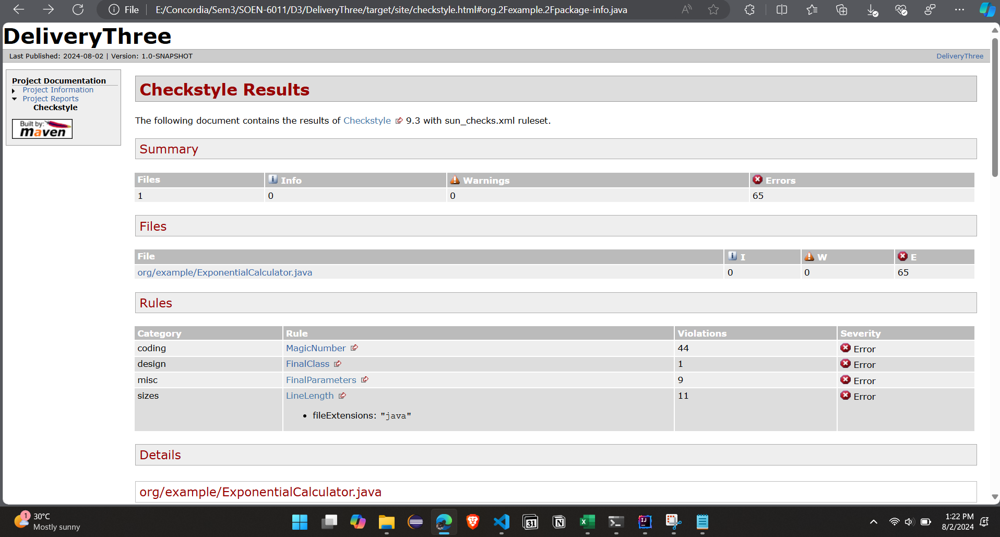
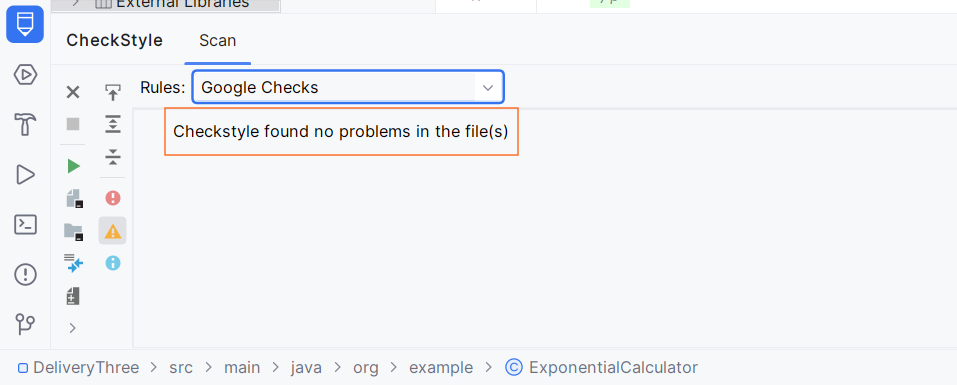
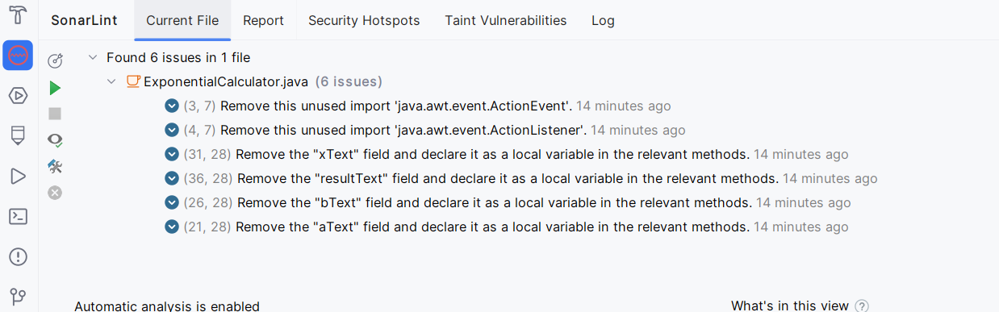
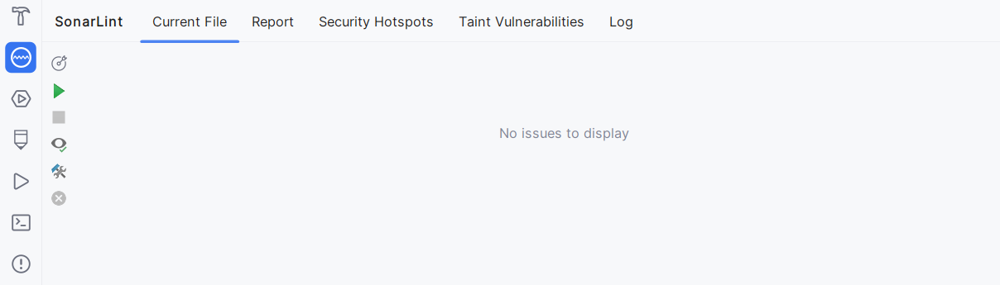
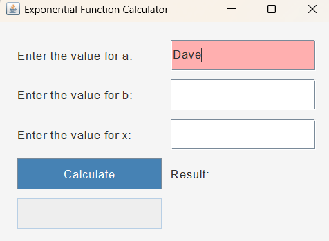
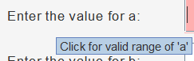
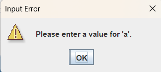

## **SOEN-6011 Delivery 3**

### 1. Java Source Code Conformance:

    To ensure that the Java source code adheres to established programming styles, we utilized Checkstyle. The following images illustrate the process and results:
    Checkstyle Before Correction:
       
    
    Checkstyle After Correction:
        
    
    IDE checkstyle plugin:
       

### 2. SonarCloud Static Code Analysis:

    SonarCloud was used for static code analysis, initially revealing three issues: two high-priority and one medium-priority. 
    The following images show the issues before and after remediation:
    
    Sonar cloud static code analysis result
   
   
    It provided with three issues two highly prioritized and 1 of medium priority
   
    Below is the image after the issue are fixed.
    

### 3. Sonarlint analysis
   Before:
   
   
   After solving the issues:
   

### 4. Design Principles and Accessibility Features:

    The ExponentialCalculator application is designed with the following principles to ensure usability and a positive user experience:
    
    **User-Centric Design**: The user interface (UI) is crafted to be intuitive with clearly labeled input fields and prominent error messages guiding users through data entry.
    
    **Separation of Concerns**: The code is organized into distinct methods and classes, enhancing readability and maintainability.
    
    **Consistency**: Uniformity in fonts, colors, and button styles provides a cohesive look and feel throughout the application.
    
    **Error Handling**: Robust error handling mechanisms manage invalid inputs and calculation errors, providing clear feedback through dialogs and visual indicators.
    
    **Responsive Design**: The layout adapts well to different window sizes and resolutions, ensuring usability across various devices.
    
    **Accessibility Features:**
    
    **Color Contrast**: High-contrast colors are used to improve readability, with distinct colors for error messages.
    
    
    **Tooltips and Error Messages**: Tooltips offer additional information on valid input ranges, and real-time error messages are displayed for invalid inputs.
    
    
    **Keyboard Navigation**: The application supports keyboard navigation, facilitating interaction for users who rely on keyboard input.
    
    **Real-Time Validation**: Immediate feedback on user input is provided through DocumentListener, helping users correct errors as they enter data.
    
    Error Messages: Clear and descriptive error messages guide users on necessary corrections, enhancing accessibility for users with cognitive disabilities.
    

### 5. Unit test
   The ExponentialCalculatorTest class contains unit tests for the ExponentialCalculator class. These tests are designed to validate the functionality and correctness of various methods within the ExponentialCalculator class. The tests cover a range of scenarios to ensure that the methods behave as expected under different conditions. Below is an overview of the tests included:

    **Tests Overview**
    1. testComputeExponentialFunction_validInputs
    
    Purpose: Verify that the computeExponentialFunction method correctly computes the result for valid inputs.
    Inputs: a = 2.0, b = 3.0, x = 2.0
    Expected Result: 18.0
    
    2. testComputeExponentialFunction_zeroBase
    
    Purpose: Check that the method handles a zero base correctly.
    Inputs: a = 2.0, b = 0.0, x = 2.0
    Expected Result: 0.0 
    
    3. testComputeExponentialFunction_invalidBase
    
    Purpose: Ensure that the method throws an IllegalArgumentException for an invalid base.
    Inputs: a = 2.0, b = -1.0, x = 2.0
    Expected Exception: IllegalArgumentException with the message "Logarithm of non-positive numbers is undefined."
    
    4. testPower_validInputs
    
    Purpose: Validate that the power method computes the result correctly for valid inputs.
    Inputs: base = 2.0, exponent = 3.0
    Expected Result: 7.999999999746713 
    
    5. testPower_zeroBase
    
    Purpose: Test the power method with a zero base.
    Inputs: base = 0.0, exponent = 3.0
    Expected Result: 0.0 
    
    6. testPower_zeroExponent
    
    Purpose: Verify that the method handles zero exponent correctly.
    Inputs: base = 2.0, exponent = 0.0
    Expected Result: 1.0 (since any number raised to the power of 0 is 1)
    
    7. testLog_validInput
    
    Purpose: Confirm that the log method computes the logarithm correctly for a valid input.
    Inputs: x = 2.718281828459045 
    Expected Result: 1.0
    
    8. testLog_nonPositiveInput
    
    Purpose: Ensure the log method throws an IllegalArgumentException for non-positive inputs.
    Inputs: x = -1.0
    Expected Exception: IllegalArgumentException with the message "Logarithm of non-positive numbers is undefined."

    9. testLog_zeroInput
    
    Purpose: Test the log method with zero input.
    Inputs: x = 0.0
    Expected Exception: IllegalArgumentException with the message "Logarithm of non-positive numbers is undefined."
    
    10. testExp_validInput
    
    Purpose: Verify that the exp method computes the exponential function correctly for valid input.
    Inputs: x = 1.0
    Expected Result: 2.718281828459045 (using Java's Math.exp for comparison)
    
    11. testExp_zeroInput
    
    Purpose: Test the exp method with zero input.
    Inputs: x = 0.0
    Expected Result: 1.0 
    
    12. testExp_negativeInput
    
    Purpose: Validate that the exp method handles negative input correctly.
    Inputs: x = -1.0
    Expected Result: Result should not equal Math.exp(-1.0) due to potential implementation differences.

##### References #####
1. Creating and Writing Test in JUNIT5 : https://www.jetbrains.com/help/idea/junit.html
2. Checkstyle: https://checkstyle.org/idea.html
3. Sonarlint : https://medium.com/@tarunchhabra/using-sonarlint-with-sonarqube-in-intellij-ide-5128111d1b8d
4. Codestyle: https://medium.com/codex/mastering-code-aesthetics-setting-up-google-code-style-in-intellij-like-a-pro-d43b306e3e6b
