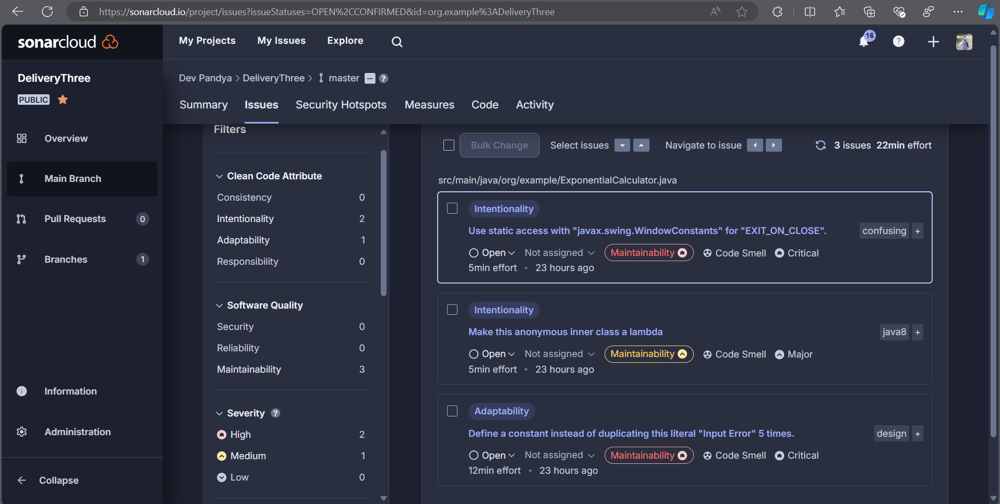

# SOEN-6011 Delivery 3

## Response to tasks

#### Problem 5: Modify, as necessary, the implementation of your function in D2/Problem 3 to satisfy the following:

1. Your Java source code must conform to an established programming style for Java.
   (There are multiple such programming styles.) Use a mind map to decide a
   programming style.
   You must use a styling tool, such as Checkstyle or PMD, to check the conformance
   of your Java source code with the corresponding programming style. You must
   include one or more snapshots of the styling tool you used to show its usage.

   Before checkstyle correction
   

   After checkstyle correction
   

   IDE checkstyle plugin 
   

2. Sonar cloud static code analysis result
   
   It provided with three issues two highly prioritized and 1 of medium priority
   
   Below is the image after the issue are fixed.
   

3. Sonarlint analysis
   Before:
   
   
   After solving the issues:
   

4. **Using Design Principles and making program accessibile**. 

   The ExponentialCalculator application adheres to several key design principles to ensure usability, maintainability, and a positive user experience:

   - User-Centric Design: The user interface (UI) is designed to be intuitive and easy to navigate. Input fields are clearly labeled, and error messages are prominently displayed to guide users through the process of entering valid data.
   
   - Separation of Concerns: The application follows the principle of separation of concerns by organizing code into distinct methods and classes. This modular approach enhances code readability and maintainability.
   
   - Consistency: Consistent use of fonts, colors, and button styles ensures a cohesive look and feel throughout the application. This consistency helps users quickly familiarize themselves with the interface.
   
   - Error Handling: Comprehensive error handling is implemented to manage invalid inputs and calculation errors. Users receive clear and actionable feedback through dialogs and visual indicators, such as background color changes for text fields.
   
   - Responsive Design: The application uses a responsive layout with grid-based placement of components, ensuring that the UI adapts well to different window sizes and resolutions.

   
   To ensure the application is accessible to users with varying needs, the following accessibility features are incorporated:

   - Color Contrast: High-contrast colors are used for buttons and text fields to improve readability for users with visual impairments. Error messages are displayed in distinct colors to highlight issues.
      
   
     - Tooltips and Error Messages: Tooltips are provided for input labels to offer additional information about valid input ranges. Real-time error messages are displayed through JOptionPane dialogs when invalid input is detected or when required fields are left empty.
       
      
         _Tooltip._
     
     - Keyboard Navigation: The application supports keyboard navigation, allowing users to interact with the UI elements using the keyboard. This ensures that users who rely on keyboard input can efficiently use the application.
   
     - Real-Time Validation: Real-time validation is implemented through DocumentListener to provide immediate feedback on user input. This feature helps users correct errors as they enter data, enhancing the overall user experience.
   
     - Error Messages: Error messages are designed to be clear and descriptive. They provide specific guidance on what needs to be corrected, which is crucial for users with cognitive disabilities.
         

##### References #####
1. Creating and Writing Test in JUNIT5 : https://www.jetbrains.com/help/idea/junit.html
2. Checkstyle: https://checkstyle.org/idea.html
3. Sonarlint : https://medium.com/@tarunchhabra/using-sonarlint-with-sonarqube-in-intellij-ide-5128111d1b8d
4. Codestyle: https://medium.com/codex/mastering-code-aesthetics-setting-up-google-code-style-in-intellij-like-a-pro-d43b306e3e6b
5. 
