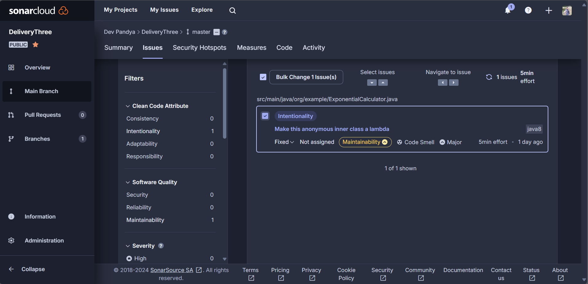

# SOEN-6011 Delivery 3

## Response to tasks

#### Problem 5: Modify, as necessary, the implementation of your function in D2/Problem 3 to satisfy the following:

1. Your Java source code must conform to an established programming style for Java.
   (There are multiple such programming styles.) Use a mind map to decide a
   programming style.
   You must use a styling tool, such as Checkstyle or PMD, to check the conformance
   of your Java source code with the corresponding programming style. You must
   include one or more snapshots of the styling tool you used to show its usage.

   Before checkstyle correction
   

   After checkstyle correction
   

   IDE checkstyle plugin 
   

2. Sonar cloud static code analysis result
   
   It provided with three issues two highly prioritized and 1 of medium priority
   
   Below is the image after the issue are fixed.
   

3. Sonarlint analysis
   Before:
   
   
   After solving the issues:
   